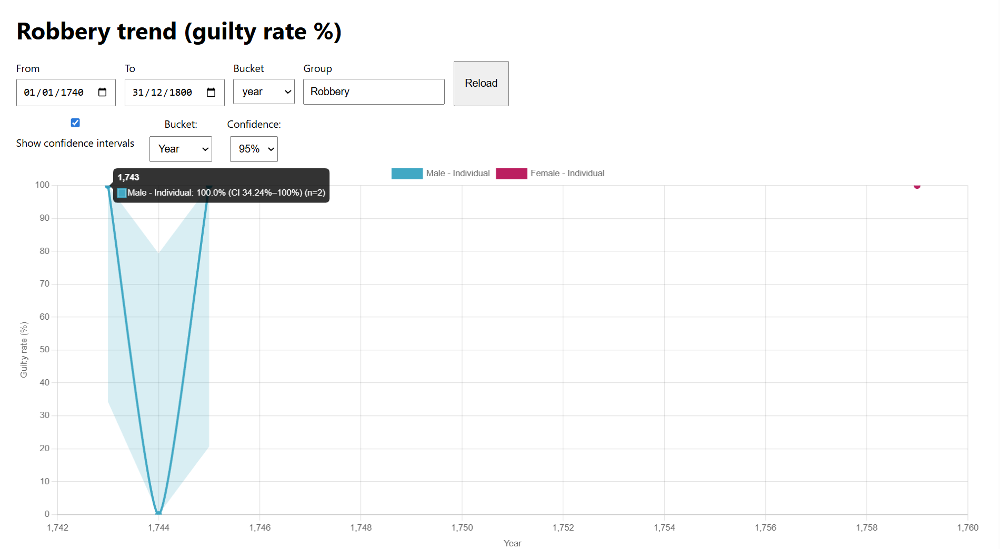
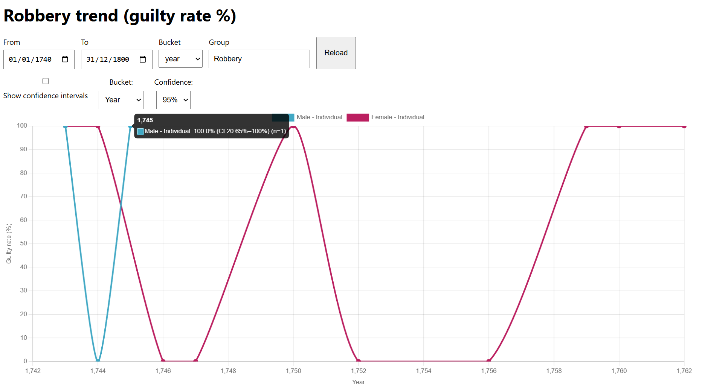
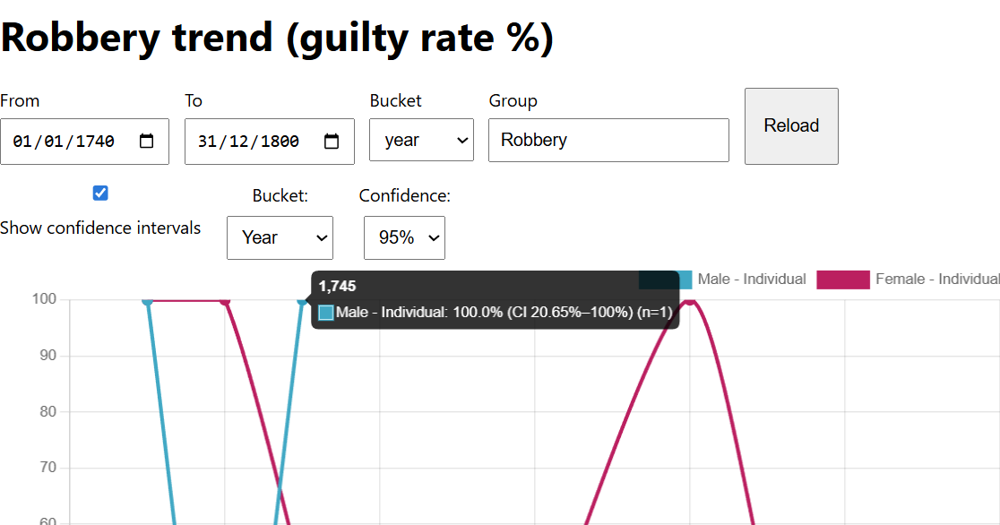

🗺️ Roadmap

📍 Geospatial queries (historic crimes near user location)

🧭 Time-aware mapping (crime scenes layered by century)

🗃️ Expanded datasets (non-violent crimes, sentencing outcomes)

🌍 Public demo deployment

⚠️ Notes

# Historic Crime Atlas

Historic Crime Atlas is an interactive data-visualisation project exploring historical crime trends using structured court records.
It allows users to analyse verdict patterns over time, segmented by gender and party type, with statistically meaningful confidence intervals.

The project is inspired by historical court archives (e.g. Old Bailey records) and aims to make centuries-old crime data accessible, explorable, and visually intuitive.

Features

📈 Interactive line charts showing guilty rate (%) over time

📊 Wilson confidence intervals with smooth fade-in/out animation

🎛️ Dynamic controls for:

Date range

Time bucket (year / decade)

Confidence level (e.g. 95%)

Crime category (e.g. Robbery)

🧠 Hover tooltips showing:

Guilty rate

Confidence interval bounds

Sample size (n)

🎨 Automatic colour scaling per group (stable & readable)

⚡ Fast API responses backed by MySQL

📘 Methodology
Guilty Rate Calculation

For each time bucket (year or decade), the guilty rate is calculated as:

Numerator: number of trials with verdict = Guilty

Denominator: number of trials with known verdicts (Guilty or Not Guilty)
This avoids bias from missing or indeterminate verdicts.

Wilson Score Confidence Intervals

Because historical datasets often have small sample sizes, especially when broken down by gender, offence, or time period, this project uses Wilson score intervals rather than normal (Wald) intervals.

Wilson intervals:

Remain valid for small n
Never produce impossible values (<0% or >100%)
Are widely recommended for binomial proportions
The confidence level (90%, 95%, 99%) is selectable in the UI and is converted internally into a z-score.

Why Wilson Instead of “Standard” CI?
Method Problem

Wald (normal) Breaks down with small samples
Wilson Stable, bounded, statistically robust ✅

This choice makes the trends more trustworthy when data is sparse — common in early historical records.

🗺️ Spatial Analysis (Nearby Historic Crimes)
Distance Calculation (Haversine Formula)

To find crimes near a user’s location, the API uses the Haversine formula, which calculates great-circle distance between two latitude/longitude points on Earth.

Distance is calculated in meters
Results are filtered by radius (50m – 20km)
Returned results are sorted by proximity
This allows users to explore what crimes happened near where they are standing today, even if those crimes occurred centuries ago.

Why Not Straight-Line (Planar) Distance?
Because Earth is curved.

Haversine:
Is accurate over city-scale distances
Requires no GIS extensions
Works efficiently in SQL

🧠 UX Decisions
Confidence Interval Bands
CI bands are rendered as translucent fills
Smooth fade-in / fade-out animation
Visibility controlled independently from the main trend line
This avoids clutter while keeping uncertainty visible when needed.

Interactive Legend
Clicking a legend item:
Toggles the entire dataset group
Main line
Confidence band
Upper CI boundary
This keeps the chart intuitive while preserving statistical context.

📍 Map Behaviour
Marker Clustering
When multiple crimes share similar coordinates:
Markers are clustered automatically
Clusters expand smoothly on zoom
Small positional jitter prevents exact overlaps
This ensures clarity without distorting spatial meaning.

🎓 Educational Focus
This project is designed as an educational exploration tool, not just a data viewer.
Users can:
Compare historical justice outcomes
Explore uncertainty in sparse data
Experience crime geography across centuries
Relate modern locations to historical events

🚧 Project Status
This project is actively evolving.
Planned enhancements include:
Leaflet UX improvements (clustering controls, legends)
Time sliders for spatial filtering
Accessibility enhancements
Internationalisation (i18n)
Optional AR-based educational experiences

🛠️ Tech Stack
Node.js + Express
MySQL
Chart.js
Leaflet.js + MarkerCluster
Vanilla JS (no framework lock-in)

## Run locally

1. Install dependencies:
   ```bash
   npm install
   ```
2. Create a `.env` file (see below)
   DB_HOST=localhost
   DB_USER=your_user
   DB_PASSWORD=your_password
   DB_NAME=your_database
   PORT=3000

3. Start the server:
   node server.js

4. Open:
   API: http://localhost:3000/api/stats/gender-party/over-time

   UI: http://localhost:3000

Historical data is partially seeded for development and visual validation purposes.
Early periods show sparse female data, resulting in wider confidence intervals.
This accurately reflects historical court record imbalance rather than a charting error.



## 📊 Interactive Data Visualisation

### Guilty Rate Trends (Robbery, 1740–1800)

**Confidence Intervals Enabled (Wilson score)**


**Confidence Intervals Disabled**


**Hover Tooltips**


Nearby Historic Crimes API

GET /api/trials/nearby?lat=51.509865&lng=-0.118092&from=1740-01-01&to=1800-12-31&radius=2000&limit=5
Returns the nearest historic trials within a given radius using Haversine distance.
