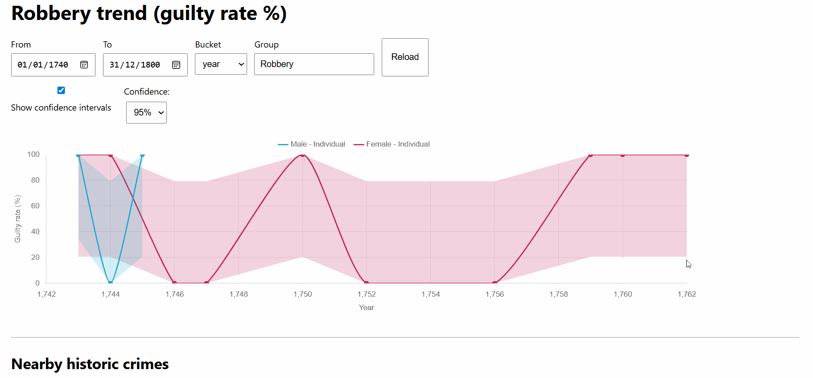
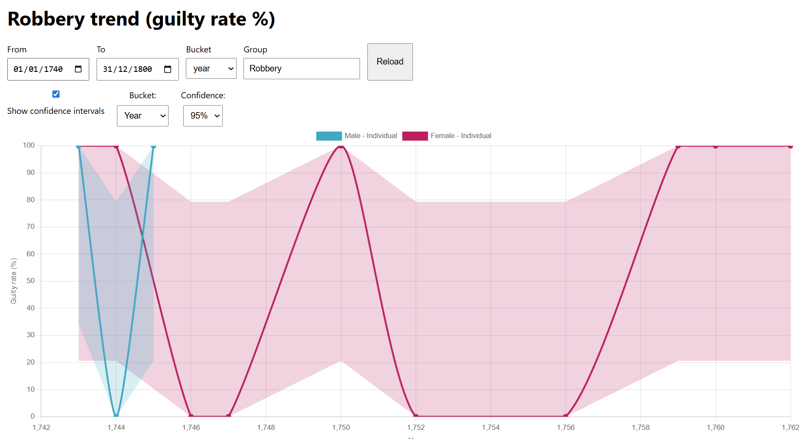
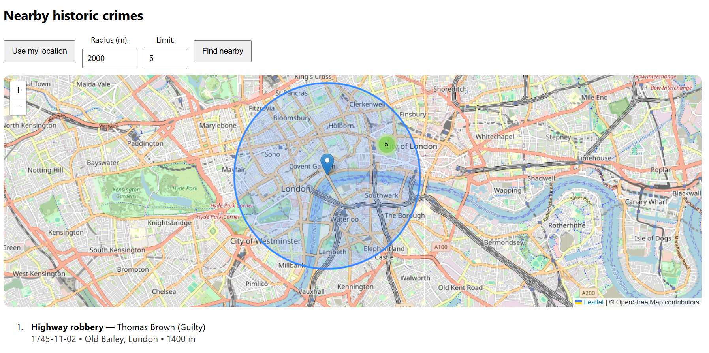

# Historic Crime Atlas 🗺️📊

Historic Crime Atlas is an interactive research interface for exploring patterns in historic criminal trials across time and place.

The project combines statistical visualisation with geospatial mapping to make archival court data understandable to modern audiences — allowing users to investigate how justice, conviction rates, and recorded behaviour changed across history.

Rather than presenting records as static documents, the atlas treats historical data as something navigable: users can move through years, locations, and individual cases to see patterns emerge directly from the evidence.

Built as a public-history platform with a focus on transparency, interpretability, and user experience.

---

## Key Capabilities

- Time-series conviction rate analysis with optional confidence intervals
- Location-based discovery of nearby historic trials
- Clustered map exploration of recorded events
- Fully synchronised map ↔ list interaction
- Contextual hover and click inspection of individual cases
- Designed to scale from development samples to full archival datasets

---

## 🧠 Tech Stack

- Vanilla JavaScript
- Chart.js
- Leaflet + MarkerCluster
- Node.js / Express
- HTML / CSS

---

## 🔍 How It Works

1. Select a date range and offence group
2. View conviction trends over time
3. Search for nearby trials using the map radius
4. Click list items or map markers to inspect individual cases

---

## 🚀 Getting Started (Local)

```bash
npm install
npm start

Open in your browser:
http://localhost:3000

## 🎥 Demo animation play best on desktop (Chrome/Firefox).

### Chart interactions
Explore conviction rates over time with optional confidence intervals.
The chart supports smooth hover tooltips and dynamic group toggling.


### Map & list interactions
Search for historic trials near a location using a radius filter.
Map markers and the results list are fully synchronised:

	•	Hover previews

	•	Click-to-pin behaviour

	•	Smooth panning and cluster expansion


🖼️ Static Views

These images provide a quick visual reference without animation.
Conviction trends with confidence intervals enabled

## 📊 Conviction Trends (CI Enabled)



## 🗺️ Nearby Historic Crimes Map



🧠 Notes on Historical Data

Sample data is partially seeded for development and visual validation
Early periods show sparse female records, resulting in wider confidence intervals
This reflects historical court record imbalance rather than a charting error

Nearby Historic Crimes API
GET /api/trials/nearby?lat=51.509865&lng=-0.118092&from=1740-01-01&to=1800-12-31&radius=2000&limit=5

## Why This Project Exists

I built this project to demonstrate how complex historical datasets can be transformed into clear, interactive experiences without sacrificing data integrity.

The application combines time-series analysis with geospatial search to allow users to explore conviction trends and nearby historic trials across a defined period. Particular care was taken to ensure that uncertainty, sparse records, and historical imbalance are communicated transparently rather than hidden or normalised.

From a technical perspective, the project focuses on:
clean state management across charts, maps, and lists
synchronised UI interactions (hover, click, pan, and highlight)
scalable architecture that can transition from demo data to full historical datasets

The result is a platform that balances analytical accuracy with polished user experience, demonstrating both front-end interaction design and data-aware engineering.


This application was developed to explore how historical criminal justice data can be meaningfully re-presented using modern interactive visualisation techniques.

Historic trial records are typically accessed through static archives, limiting engagement and interpretability. By transforming these records into time-series charts and geospatial queries, this project enables users to observe long-term patterns in conviction outcomes while remaining grounded in the social and legal contexts of their time.

The application deliberately spans from the earliest available court records through to the nineteenth century, preserving temporal continuity while exposing shifts in prosecution, verdict frequency, and spatial concentration. Variations in data density—particularly across gender—are presented transparently, reflecting historical record imbalance rather than analytical distortion.

This work sits at the intersection of digital humanities, data visualisation, and historical inquiry, demonstrating how contemporary interfaces can support deeper engagement with archival material.


🗺️ Roadmap

📍 Geospatial queries near user location
🧭 Time-aware mapping (layered by century)
🗃️ Expanded datasets (non-violent crimes, sentencing outcomes)
🌍 Public demo deployment

```
